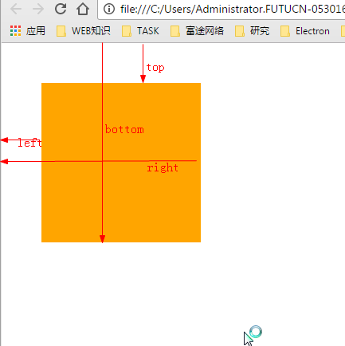

## 五分钟分享-- 图片的延迟加载小探讨

####  1.元素进入可视窗口才加载
###### 1.1  比较`item.getBoundingClientRect().top`与视窗底线`top`的大小[demo](lazyload/lazyload2.html)；
	
核心点：
`object.getBoundingClientRect()`： 获取元素的大小及其相对于视口的位置
	


```
// 用于滚动的容器
var $container = document.querySelector('.wrapper');
// 容器的下边框的offsetheight，当容器的下边框不在可视区域之内是，屏幕高度作为下边框
var bottomOffset = Math.min($container.getBoundingClientRect().bottom,window.innerHeight);
// 需要用于更新的元素
var items = [...document.querySelectorAll('.item')];

// 更新页面上的元素
function update(){
    items.forEach(item=>{
        // 元素进入视野，且没有进行处理过
        if(item.getBoundingClientRect().top <= bottomOffset &&
            !item.classList.contains('loaded')){
            var img = item.querySelector('img');
            img.setAttribute('src',img.getAttribute('link'));
            item.classList.add('loaded');
        }
    });
}

// 滚动及页面加载完成也进行处理
update();
$container.addEventListener('scroll',()=>{
    update();
});
```

###### 1.2 `IntersectionObserver`进行监视；[demo](lazylaod/lazyload1.html)
`IntersectionObserver`: 监视某个元素是否滚动进了浏览器窗口的可视区域（视口）或者滚动进了它的某个祖先元素的可视区域内
核心点：
```
let observer = new IntersectionObserver((changes) => {
        changes.forEach((change) => {
            var target = change.target.querySelector('img');
            target.setAttribute('src',target.getAttribute('link'));
            observer.unobserve(change.target);
        });
    },{
        threshold:0.2// 元素有20%的部分进入视窗才触发
    }
);
([...document.querySelectorAll('.item')]).forEach(function (item) {
    observer.observe(item);
});
```


#### 1.3 动态加载`dom`元素，滚动条到最后才加载具体img结构 [demo](lazyload/pulldownLoad.html)

核心点：`scrollHeight = scrollTop +  clientHeight + offsetToBottom（临界值）`

```
var $container = document.querySelector('.wrapper');
// 可见高度
var clientHeight = $container.clientHeight;
$container.addEventListener('scroll',function(e){
    // 可见高度
    contentH = $container.scrollHeight;
    //滚动高度
    scrollTop =  $container.scrollTop;
    // 滑动到底部了
    if(contentH - clientHeight - scrollTop < 10) {
        var li = document.createElement('li');
        li.innerHTML = tempplate;
        $container.appendChild(li);
    }
 });
```

#### 1.4 图片作为当前元素背景，父级元素设置`display:none`；
```
背景图， 当前元素设置为`display:none`，图片是否加载？
背景图， 父级元素元素设置为`display:none`，图片是否加载？
img标签， 当前元素元素设置为`display:none`，图片是否加载？
img标签，父级元素元素设置为`display:none`，图片是否加载？
```

