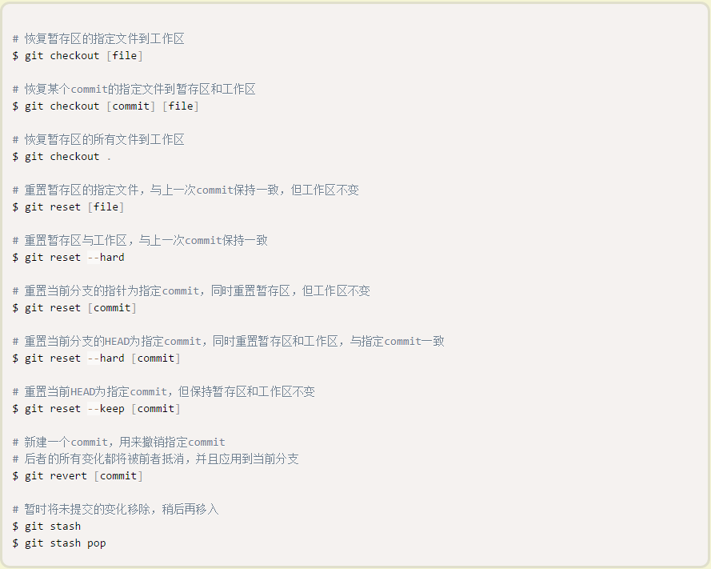

## git笔记

## git 仓库图


## 常用命令



## 笔记

######  1. 当我们commit之后突然发现漏掉了一个文件, 这个时候不可能对一个文件再进行commit一次, 这样做就显得很多余, 而如果版本回退之前再添加也比较麻烦. 这个时候就可以使用这个amend命令.如下:

```shell
$ git commit -m "版本1.5开发代码"
 
# 正当你松了一口气的时候发现配置文件忘记修改了, 你赶紧修改,并适合用add到暂存区
$ git add project.property
$ git commit --amend        
# 你会神奇的发现你没有增加任何多余的操作就把漏掉的文件补齐到最后一次提交中

```

###### 2. .gitignore无效，不能过滤某些文件
利用.gitignore过滤文件，如编译过程中的中间文件等等，这些文件不需要被追踪管理。

**现象：**
在.gitignore添加file1文件，以过滤该文件，但是通过git status查看仍显示file1文件的状态。

**原因：**
在git库中已存在了这个文件，之前push提交过该文件。
.gitignore文件只对还没有加入版本管理的文件起作用，如果之前已经用git把这些文件纳入了版本库，就不起作用了

**解决：**
需要在git库中删除该文件，并更新。
然后再次git status查看状态，file1文件不再显示状态。

###### 3. 更新submodule的URL
```shell
- 更新 .gitsubmodule中对应submodule的条目URL

- 更新 .git/config 中对应submodule的条目的URL

- 执行 git submodule sync
```

###### 4. 增加子模块
 
- 添加子模块： `git submodule add http://gitlab.futunn.com/alanzhang/[componentname].git ./submodule/[componentname]`
- 更新各个子模块： `git submodule init;git submodule update;git submodule foreach "git checkout master;git pull origin master;"`
- 批量执行任务:`git submodule foreach 'commend ...'`
 
##### 5. 重写提交历史说明

- 改变最近一次提交
    + git commit --amend -m'这是新的提交说明'
    + 不能对已经push的提交做修改comment

##### 6. 删除分支
```shell
# 删除远程分支
git push -d origin hotfix/xxxxxxx
#删除本地分支，这个只能删除本地分支，要先删除远程再删除本地
# 网上有 git fetch -p和git remote prune这种可以删除 远程分支被删除了的本地分支，但是实际测试没有效果
git branch -d -r branchnam
```
不知道为啥`git branch -d -r branchname`删除分支后，再次git ppull 会重新出现该分支

##### 7. 切换分支

```shell
- 且回上一个使用过的分支:git checkout -
```

##### 8. .gitkeep文件的用处

- git无法追踪一个空的文件夹，当用户需要追踪(track)一个空的文件夹的时候,在文件夹中加入`.gitkeep`文件（文件内容为空）即可

##### 9. github 做push的时候（http的方式）总是提示输入用户名和密码

- 方法1：使用ssh 的方式并设置key
- 方法2：
```shell
# 查看项目是用http还是git协议进行的下载
# 比如会输出：origin  https://github.com/AlanZhang001/webtouch.git (fetch)
git remote -v
# 1. 进入项目根目录
# 2. 运行如下命令即可：
git config --global credential.helper store
```

##### 10. git remote 

```shell
# 显示git 项目的url信息
git remote -v

# 显示当前项目的所有信息,比git branch -at更加详细
git remote show origin

# 显示所有的远程分支及其最新commitid
git ls-remote
```

##### 11. origin 是什么？
“origin” 并无特殊含义。

远程仓库名字 “origin” 与分支名字 “master” 一样，在 Git 中并没有任何特别的含义一样。 同时 “master” 是当你运行 git init 时默认的起始分支名字，原因仅仅是它的广泛使用，“origin” 是当你运行 git clone 时默认的远程仓库名字。

##### 12. git log

```shell
# 显示提交说明、提交者以及提交日期，还会显示这每次提交实际修改的内容。
git log -p filename

# git log 输出参数：
git log --author=“Alex Kras” ——只显示某个用户的提交任务
git log --name-only ——只显示变更文件的名称
git log --oneline——将提交信息压缩到一行显示
git log --graph ——显示所有提交的依赖树
```

##### 13. 查看其它分支的文件

```shell
# 查看其他分支上的文件而无需切换到那个分支
git show some-branch-name:some-file-name.js
# 查看另一个分支上文件与当前分支上文件的差异
git diff some-branch some-filename.js
# 查看diff时，不显示空格变更
git diff -w
```

## 待搞清楚的事情

- git rebase 和git merge的区别
- git pull --rebase后面的--rebase有什么特别的作用
- git reflog的用处

## 学习参考链接
- 日常使用 Git 的 19 个建议<https://juejin.im/entry/56737bca00b0bf37ccb00ebe>
- 常用 Git 命令清单<http://www.ruanyifeng.com/blog/2015/12/git-cheat-sheet.html>
- [github设置添加SSH](https://www.cnblogs.com/ayseeing/p/3572582.html)

