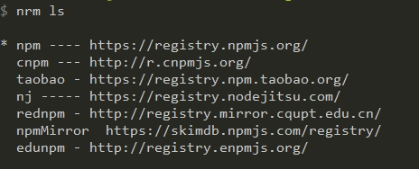
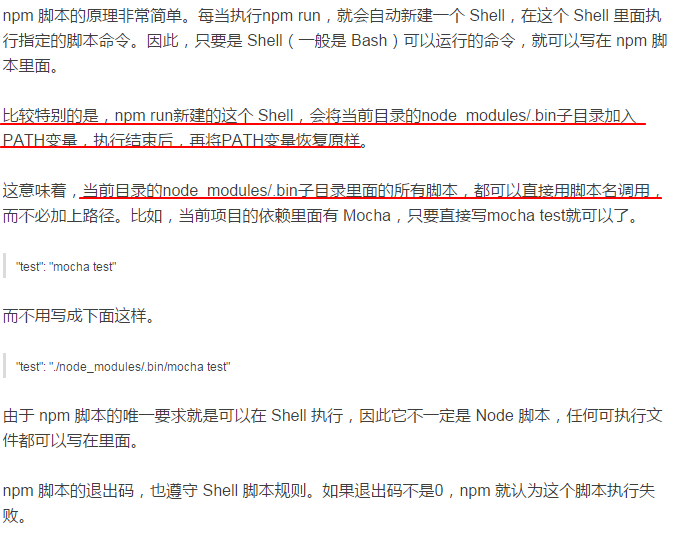

## npm笔记

## 笔记

###  实用命令：

###### 1. 实用工具包
**nrm**：用来切换npm仓库源的包




**concurrently**:可以在npm scripts中执行多进程。

在日常开发我们经常会遇到一个用于静态资源的服务器，一个是 业务的 Web 服务器，我们也可以单独拆分。 即分开成两个命令启动。这个适合使用 concurrently 就非常方便了。


###### 2. 全局模式和本地模式
node的安装分为全局模式和本地模式。直接通过require()的方式是没有办法调用全局安装的包的。全局的安装是供命令行使用的

###### 3. npm outdated
检查包是否已经过时，此命令会列出所有已经过时的包，可以及时进行包的更新

###### 4. npm view
```
npm view ui-mcalendar versions：查看某个package的所有版本信息
npm view moduleNames：查看node模块的package.json文件夹
npm view moduleName repository.url：查看包的源文件地址
npm view moudleName dependencies：查看包的依赖关系
```

###### 5. npm conifg
```
npm config list：参看当前node的配置信息
npm config get [keyName]：参看当前node的配置信息中具体的属性，这里指list中出现的属性
npm config set registry https://registry.npmjs.org/: 设置npm的镜像源地址
```

###### 6. 发布及安装
```
npm root：查看当前包的安装路径
npm root -g：查看全局的包的安装路径
npm update moduleName：更新node模块
npm uninstall moudleName：卸载node模块
npm publish: 发布某一个包至npm
npm unpublish packageName@x,y.x: 取消某个版本的发布状态
npm prune: 列出在node_modules中存在但是为在package.json中保存的npm包
npm home $package: 打开某个包的主页
npm install --only=dev:只安装devDependencies中的依赖
```

###### 7. env
列出所有的环境变量,注意需要在bash的环境下运行

###### 8. npm run原理



## 学习参考链接

- package.json 字段说明: <http://mujiang.info/translation/npmjs/files/package.json.html>
- npmjs: <https://docs.npmjs.com/cli/>